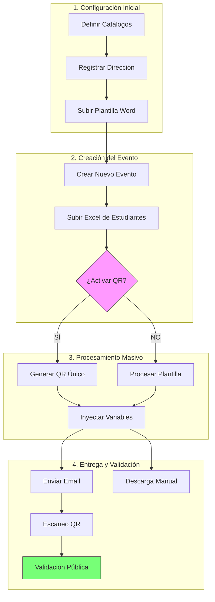

# Guía de Variables y Plantillas - Sistema de Certificados UNEMI

Este documento detalla las variables que el sistema puede inyectar automáticamente en las plantillas de Microsoft Word (`.docx`) y el formato requerido para los archivos Excel de los estudiantes.

## Flujo de Trabajo del Sistema

### Detalle de la Configuración Inicial

Para configurar correctamente el sistema por primera vez, siga este orden:

1. **Definir Catálogos**: Son las opciones globales que aparecerán en los formularios. 
   - **Modalidades**: Ej. Presencial, Virtual, Híbrido.
   - **Tipos**: Ej. Aprobación, Participación, Asistencia.
   - **Tipos de Evento**: Ej. Taller, Seminario, Curso.

2. **Registrar Dirección / Gestión**: Representa el área o departamento que emite el certificado (ej: *Dirección de Vinculación*). 
   - Cada Dirección actúa como un contenedor de sus propias plantillas y eventos.

3. **Subir Plantilla Word**: Es el diseño base en formato `.docx`. 
   - Se debe cargar **una plantilla por cada Dirección**. 
   - La plantilla debe contener las etiquetas `{{VARIABLES}}` exactamente donde desea que aparezca la información real.

---

## Variables de la Plantilla Word

El sistema busca etiquetas rodeadas por llaves dobles (ej: `{{VARIABLE}}`) y las reemplaza con los datos reales. Las variables son **case-sensitive** (se recomienda usarlas en MAYÚSCULAS).

### Variables de Identificación
| Variable | Descripción | Ejemplo de Salida |
| :--- | :--- | :--- |
| `{{NOMBRES}}` | Nombres completos del estudiante | LUIS ARGUELLO |
| `{{MODALIDAD}}` | Modalidad del evento | Presencial |
| `{{TIPO}}` | Tipo de certificación | Aprobación |
| `{{TIPO DE EVENTO}}` | Clasificación del evento | Taller |

### Variables del Programa
| Variable | Descripción | Ejemplo de Salida |
| :--- | :--- | :--- |
| `{{NOMBRE CURSO}}` | Nombre oficial del evento | Marketing y Ventas en Ferias |
| `{{HORAS}}` | Número de horas de duración | 96 |
| `{{OBJETIVO DEL PROGRAMA}}` | Objetivo registrado en el sistema | Capacitar en técnicas de venta... |
| `{{CONTENIDO}}` | Temario o contenido detallado | 1. Introducción, 2. Estrategia... |

### Variables de Fecha
| Variable | Descripción | Ejemplo de Salida |
| :--- | :--- | :--- |
| `{{FECHA INICIO}}` | Fecha de inicio (sin año) | 16 de septiembre |
| `{{FECHA FIN}}` | Fecha de fin (con año) | 14 de octubre de 2025 |
| `{{FECHA DE EMISION}}` | Formato legal de expedición | 30 días del mes de febrero del 2026 |

---

## Formato del Archivo Excel

El sistema es flexible y detectará automáticamente las columnas necesarias basándose en el nombre de la cabecera (primera fila).

### Columnas Requeridas
| Columna Proporcional | Variantes Aceptadas | Función |
| :--- | :--- | :--- |
| **Nombres** | NOMBRES COMPLETOS, NOMBRE, ESTUDIANTE, PARTICIPANTE | Nombre que aparecerá en el certificado |
| **Email** | CORREO ELECTRONICO, CORREO, EMAIL, MAIL | Dirección donde se enviará el PDF |

> [!IMPORTANT]
> **Asegúrese de:**
> 1. No dejar filas vacías entre estudiantes.
> 2. Los correos no deben contener espacios ni tildes.
> 3. El archivo debe ser formato `.xlsx` o `.xls`.

---

## Ejemplo de Redacción en Word

Puede usar el siguiente ejemplo como base para su diseño en Word:

**CERTIFICADO**  
Otorgado a:  
**{{NOMBRES}}**

Por su **{{TIPO}}** en **{{TIPO DE EVENTO}}**: "**{{NOMBRE CURSO}}**", con una duración de **{{HORAS}}** hora(s), realizado del **{{FECHA INICIO}}** al **{{FECHA FIN}}**.

La Universidad Estatal de Milagro a través de la Gestión de Educación Ciudadana de la Escuela de Formación y Emprendimiento, expide el presente certificado en Milagro, a los **{{FECHA DE EMISION}}**.

---

## Seguridad QR
Si el evento tiene activada la **Seguridad QR**, el sistema estampará automáticamente un código en la esquina inferior derecha del PDF generado. Este código permitirá validar la autenticidad del documento escaneándolo con cualquier dispositivo móvil.
